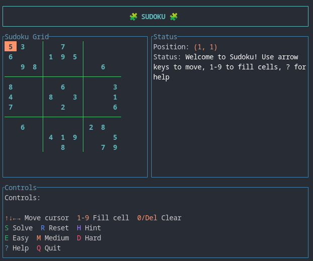

# 🧩 Sudoku TUI

A modern, interactive Sudoku terminal user interface built with Rust, featuring beautiful colorized grids, intelligent hints, and multiple difficulty levels.




## ✨ Features

- **🎨 Beautiful Terminal UI**: Colorized grid with clear 3×3 block boundaries
- **⌨️ Intuitive Controls**: Easy keyboard navigation and number input
- **🔍 Smart Hints**: Intelligent hint system that cycles through available options
- **🚫 Input Validation**: Real-time error detection with visual feedback
- **🎯 Multiple Difficulty Levels**: Easy, Medium, Hard, and Expert puzzles
- **🔄 Auto-Solver**: Automatic puzzle solving with backtracking algorithm
- **📋 Help System**: Built-in help with controls and gameplay instructions
- **💾 Reset & Generate**: Reset current puzzle or generate new ones instantly

## 🚀 Installation

### Prerequisites

- [Rust](https://rustup.rs/) 1.70.0 or higher
- A terminal with Unicode support

### Build from Source

```bash
git clone https://github.com/iamdhakrey/sudoko.git
cd sudoko/sudoko-tui
cargo build --release
```

### Run the Application

```bash
cargo run --release
```

Or run the compiled binary:

```bash
./target/release/sudoko-tui
```

## 🎮 How to Play

### Objective
Fill the 9×9 grid so that each row, column, and 3×3 box contains all digits from 1 to 9.

### Controls

#### Navigation
- **Arrow Keys** (`↑↓←→`): Move cursor around the grid
- **Numbers** (`1-9`): Fill the selected cell with the chosen digit
- **Clear Cell** (`0`, `Delete`, `Backspace`): Clear the selected cell

#### Game Actions
- **`S`**: Automatically solve the entire puzzle
- **`R`**: Reset puzzle to original state
- **`H`**: Get a hint for the current puzzle

#### Puzzle Generation
- **`E`**: Generate new Easy puzzle
- **`M`**: Generate new Medium puzzle
- **`D`**: Generate new Hard puzzle
- **`X`**: Generate new Expert puzzle

#### Interface
- **`?`**: Show/hide help dialog
- **`Q`**: Quit the application

### Visual Cues

- **🟡 Yellow Background**: Current cursor position
- **🔵 Cyan Numbers**: Given/preset numbers (cannot be changed)
- **⚪ White Numbers**: Numbers you filled in
- **🔴 Red Numbers**: Invalid numbers (violate Sudoku rules)
- **🟢 Green Borders**: 3×3 block separators

## 🏗️ Architecture

The Sudoku TUI is built using:

- **[ratatui](https://github.com/ratatui-org/ratatui)**: Modern terminal UI framework
- **[crossterm](https://github.com/crossterm-rs/crossterm)**: Cross-platform terminal manipulation
- **[anyhow](https://github.com/dtolnay/anyhow)**: Error handling
- **sudoko**: Core Sudoku logic library

### Key Components

```rust
struct SudokuApp {
    puzzle: Sudoku,                    // Current puzzle state
    cursor: (usize, usize),            // Current cursor position
    message: String,                   // Status message
    is_solved: bool,                   // Puzzle completion status
    mode: AppMode,                     // Current UI mode (Normal/Help)
    should_quit: bool,                 // Exit flag
    hint_tracker: Vec<(usize, usize, u8)>, // Tracks given hints
}
```

## 🎯 Difficulty Levels

| Level  | Empty Cells | Description                           |
|--------|------------|---------------------------------------|
| Easy   | 40-45      | Good for beginners, many given numbers |
| Medium | 46-51      | Moderate challenge, requires logic     |
| Hard   | 52-57      | Challenging, advanced techniques needed |
| Expert | 58+        | Very difficult, minimal given numbers  |

## 🔧 Dependencies

```toml
[dependencies]
sudoko = { path = "../sudoko" }  # Core Sudoku library
ratatui = "0.29"                 # Terminal UI framework
crossterm = "0.28"               # Cross-platform terminal
anyhow = "1.0"                   # Error handling
```

## 🤝 Contributing

Contributions are welcome! Please feel free to submit a Pull Request. For major changes, please open an issue first to discuss what you would like to change.

### Development Setup

1. Clone the repository
2. Ensure you have Rust installed
3. Run `cargo test` to run the test suite
4. Run `cargo run` to start the application
5. Make your changes and test thoroughly

## 📄 License

This project is licensed under the MIT License - see the [LICENSE](../LICENSE) file for details.

## 🙏 Acknowledgments

- Built with the excellent [ratatui](https://github.com/ratatui-org/ratatui) library
- Inspired by classic terminal-based games
- Thanks to the Rust community for amazing crates and tools

## 📊 Project Stats

- **Language**: Rust 🦀
- **UI Framework**: ratatui
- **Lines of Code**: ~540 lines
- **Features**: 15+ interactive features
- **Platforms**: Cross-platform (Linux, macOS, Windows)

---

**Happy Sudoku solving! 🧩✨**

*For issues, suggestions, or contributions, please visit the [GitHub repository](https://github.com/iamdhakrey/sudoko).*